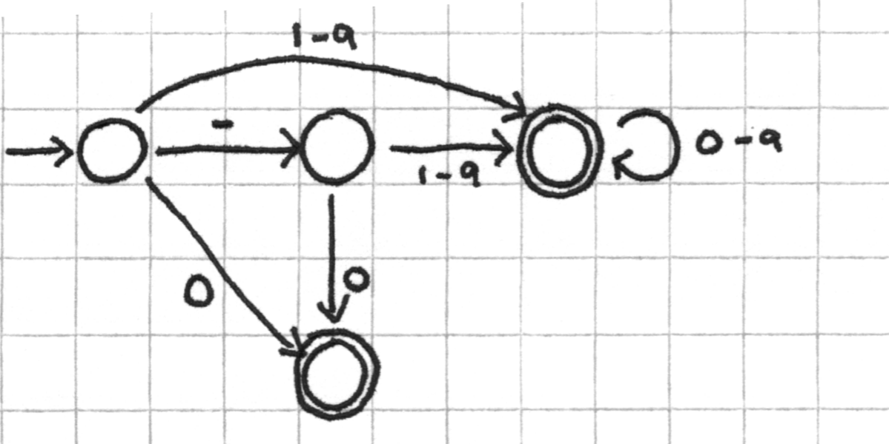
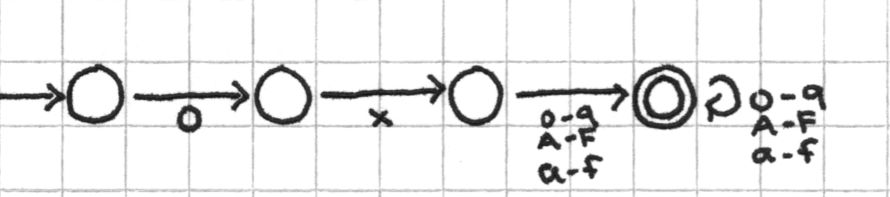
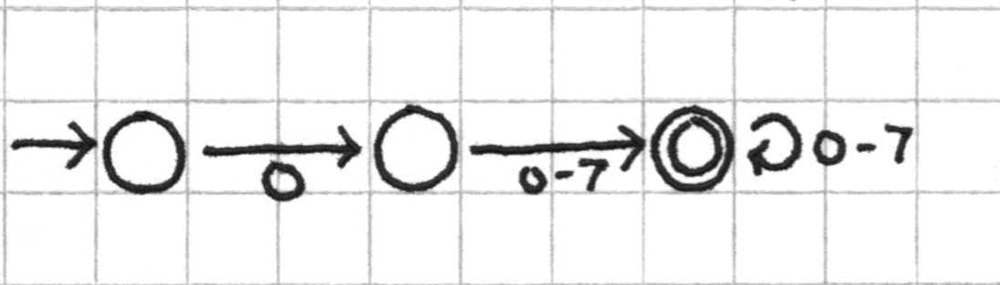
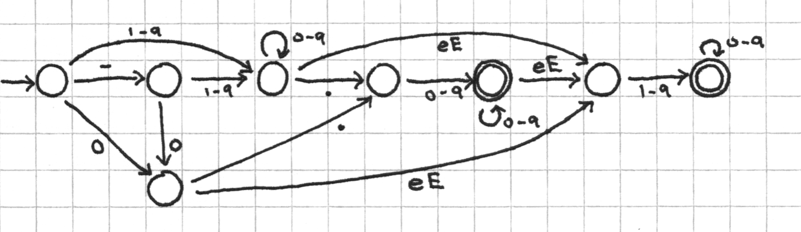
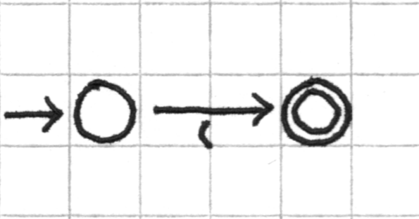
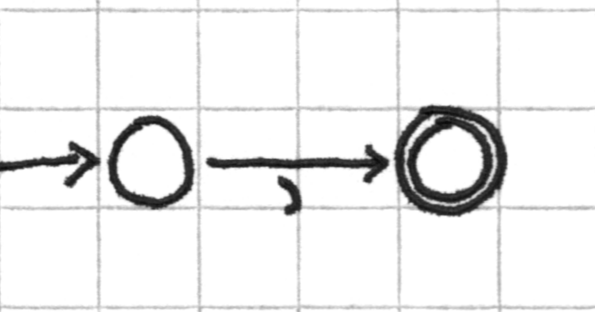
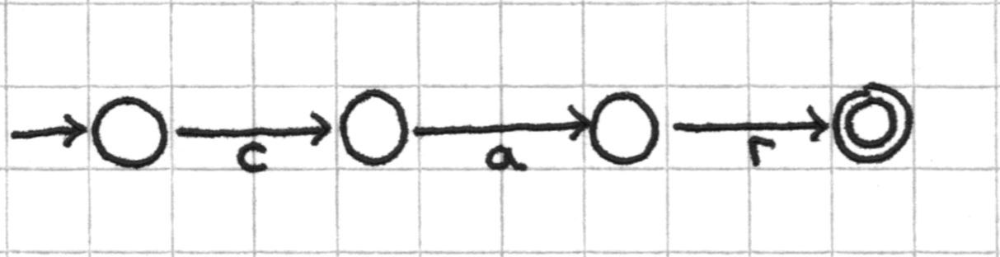
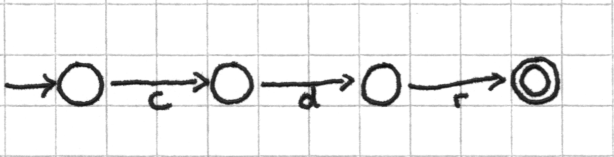
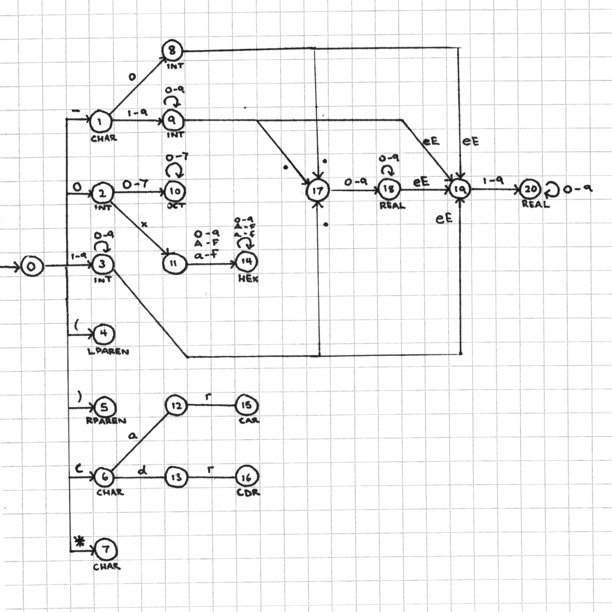

scanner
===

A simple lexical scanner.

Tokens
---

###INT

Description: *positive and negative natural numbers, including zero*

Corresponding regular expression: `-?(0|[1-9][0-9]*)`

Corresponding DFA: 

###HEX

Description: *a hexidecimal integer value (valid numerals are 0-F) with a 0x prefix*

Corresponding regular expression: `0x[0-9A-Fa-f]+`

Corresponding DFA: 

###OCT

Description: *an octal integer value (valid numerals are 0-7) with a 0 prefix*

Corresponding regular expression: `0[0-7]+`

Corresponding DFA: 

###REAL

Description: *floating point decimal and exponential notation*

Corresponding regular expression: `-?(0|[1-9][0-9]*)\.[0-9]+([eE][1-9][0-9]*)?`

Corresponding DFA: 

####LPAREN

Description: *left parenthesis '('*

Corresponding regular expression: `(`

Corresponding DFA: 

###RPAREN

Description: *right parenthesis ')'*

Corresponding regular expression: `)`

Corresponding DFA: 

###CAR

Description: *the string "car"*

Corresponding regular expression: `car`

Corresponding DFA: 

###CDR

Description: *the string "cdr"*

Corresponding regular expression: `cdr`

Corresponding DFA: 

###CHAR

Description: *any other single ASCII character*

Corresponding regular expression: `[^\(\)01-9]`

###STR

Description: *any other sequence of (more than 1) ASCII characters*

Rather than a regular expression for matching STR tokens, the token is found when the DFA is not in an accept state for any of the above tokens.

Combined DFA
---

Rather than pass a lexeme string through each regular expression/DFA until a match is found, we opt to combine the various DFAs into one large state machine that can decide the token type.

This machine is the sum of the individual tokens' DFAs, with reductions wherever possible to simplify the model. Each character read from the string progresses the machine to a new state according to a transition mapping. If at any time the string has no more characters, the machine reports the token corresponding with the current state.

If a character is read from the string, for which the current state does not have a transition mapping, the machine moves to a *"REJECT"* state (not pictured) from which there is no return. Once the machine has transitioned to the reject state, the token will always be __STR__.

The accept states are as follows:

- __INT__: 2, 3, 8, 9
- __HEX__: 14
- __OCT__: 10
- __REAL__: 18, 20
- __LPAREN__: 4
- __RPAREN__: 5
- __CAR__: 15
- __CDR__: 16
- __CHAR__: 1, 6, 7
